## Pretraining

Easiest starting point for choosing hyperparameters is to use those mentioned in the literature by the authors. The image below shows the hyperparameters the authors used to train OLMo - [2 OLMo 2 Furious](https://arxiv.org/pdf/2501.00656)
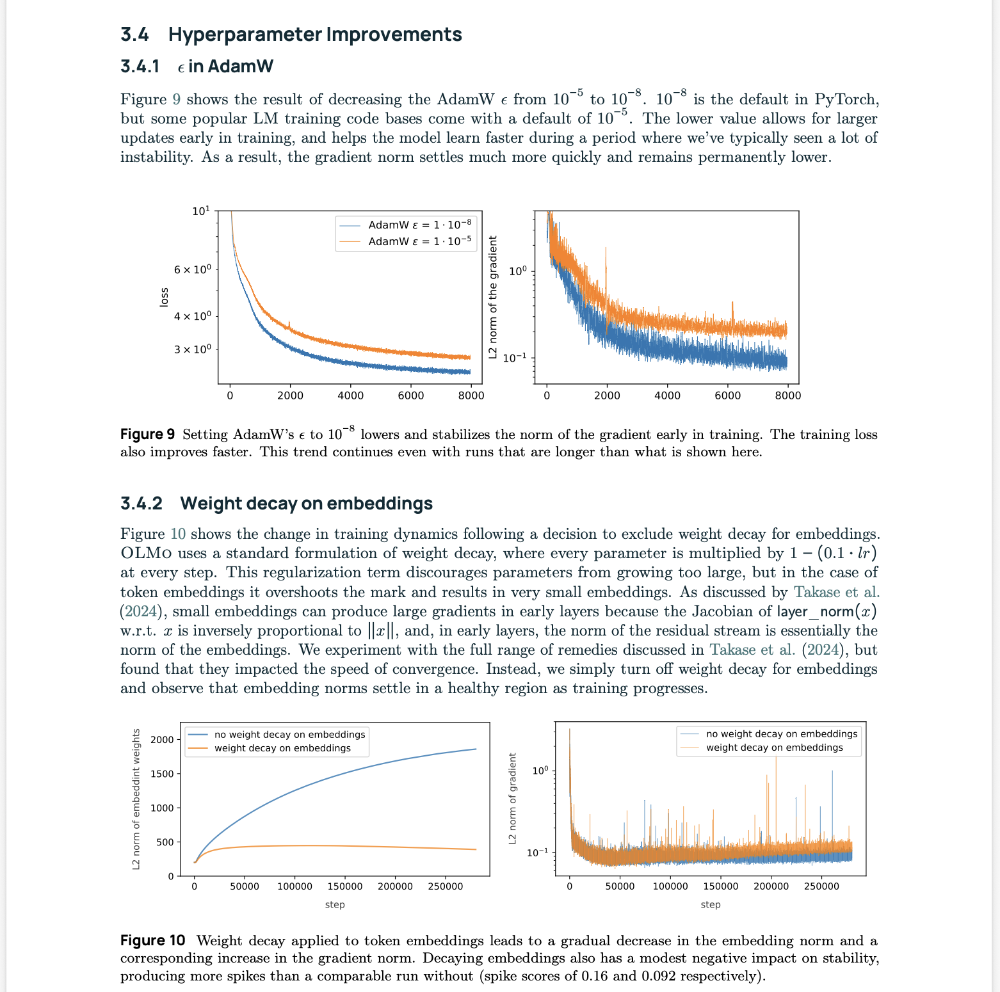

After you have selected the inital parameters, as a first step is to overfit on a small sample set. This makes sures that the implementation is correct and there are no bugs. Both the training and validation loss should be ideally ~0.

The model was trained TinyStories dataset
```sh
mkdir -p data
cd data

wget https://huggingface.co/datasets/roneneldan/TinyStories/resolve/main/TinyStoriesV2-GPT4-train.txt
wget https://huggingface.co/datasets/roneneldan/TinyStories/resolve/main/TinyStoriesV2-GPT4-valid.txt
```

The logs/graphs are stored on Weights and Biases, and Modal was used for training on GPUs.

### Tuning the learning rate

Learning rate is one of the most important parameter to tune as it single handedly dictates the speed and efficacy of the model training.
Lower learning rates are is expensive as it results in an increase in training time, and a large learning rate may not give you the most optimal model.
The best learning rate is "at the edge of stability." 

By running a parameter sweep on different learning rate (in our case multiples of 2 from $2^0$ to $2^7$), we can see where the learning rate diverges on a sufficiently sized dataset.

Looking at the Update-to-Parameter ratio:
The maximum update-to-parameter ratio observed across all individual tensors (heads/layers) in the network during a single step while training.
$$  Pmax = \max_i (||update||_2 / ||param||_2) = \max_i (||\Delta W_i||_2 / ||W_i||_2) $$

Is an effective way to monitor the training health and prevent gradient explosions or stagnations.
```
For SGD
~1e-3 -> healthy
> 1e-2 -> Exploding Volatile (decrease LR or apply gradient clipping)
< 1e-4 -> Stagnant/ Vanishing (increase LR)

For AdamW
lr × m_hat / (sqrt(v_hat) + eps)
almost 5-20x times higher
```

```python

with torch.no_grad():
    p_max = 0.0
    for name, param in model.named_parameters():
        if param.grad is not None:
            # Calculate the actual update step
            # (Alternative: cache param before step, subtract from param after step)
            step = param.grad # Standard SGD approximation; closer tracking requires delta
            
            p_norm = torch.norm(param.data).item()
            step_norm = torch.norm(step).item()
            
            if p_norm > 0:
                ratio = step_norm / p_norm
                p_max = max(p_max, ratio)
                
    # Log p_max to dashboard
```

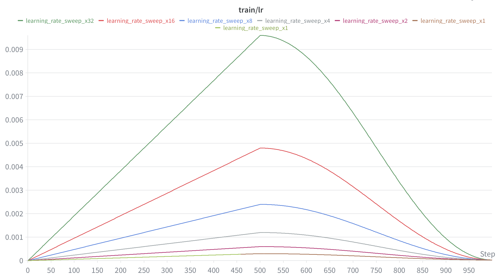
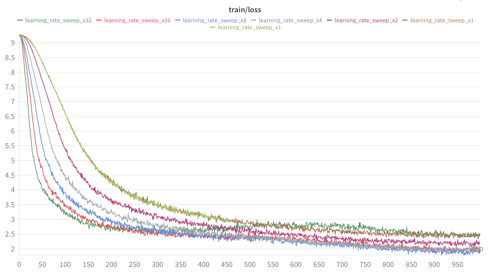
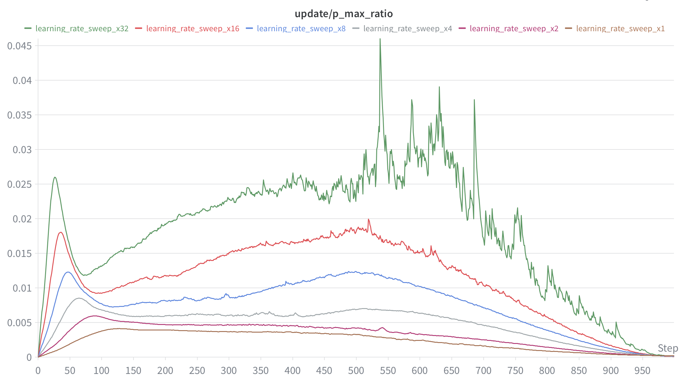
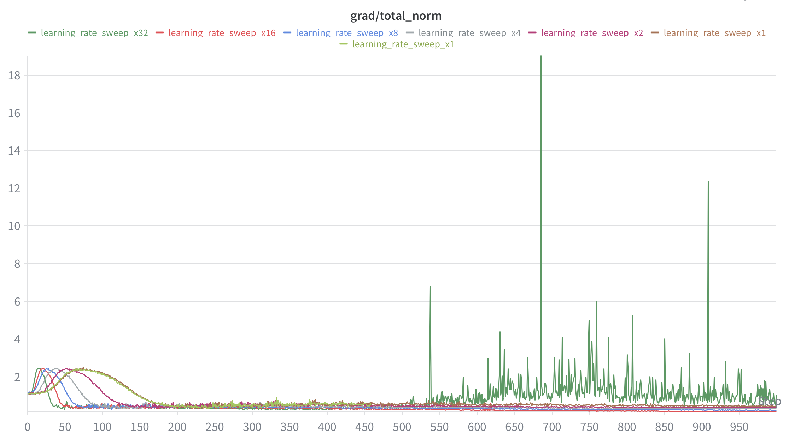

### Effect of batch size on training
On increasing batch size, we can see that the model learns faster. But this can be attributed to learning rate schedular being dependent on the amount of tokens processed for model learning (see token seen figure)

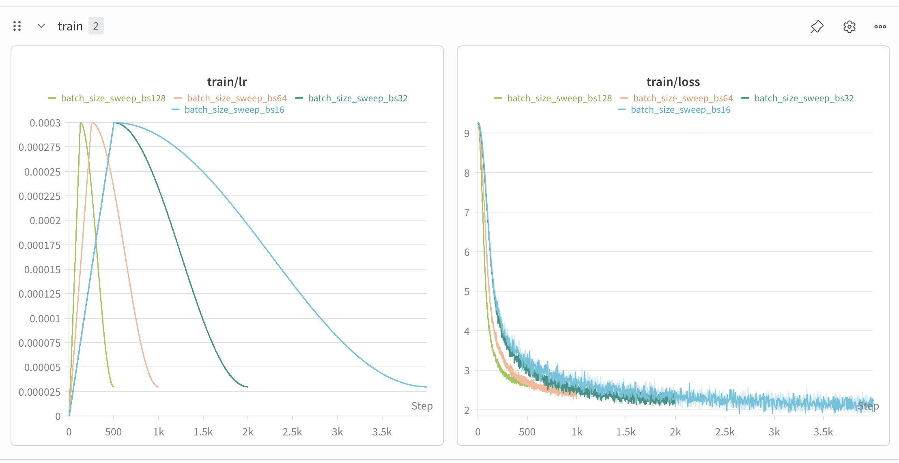
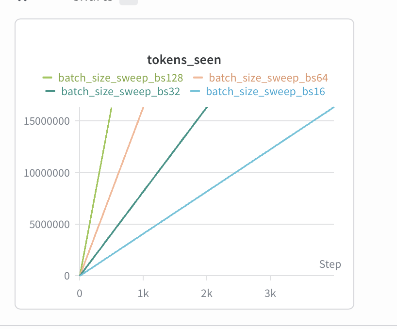


### Layer Normalization - Ablation 
#### Removing RMS Norm and Post Norm Ablation
By removing the layer normalization completely, the training becomes unstable and we start seeing Inf/NaNs. This causes the model to not learn anything. We will have to decrease the learning rate.

The gradient updates are higher for Post Norm but from the training loss both seem to converge at the same rate.


```python
if self.norm_position == "pre":
            x = x + self.mhsa(self.rmsnorm1(x), token_positions)
            x = x + self.ppff(self.rmsnorm2(x))
        else:  # "post"
            x = self.rmsnorm1(x + self.mhsa(x, token_positions))
            x = self.rmsnorm2(x + self.ppff(x))
```


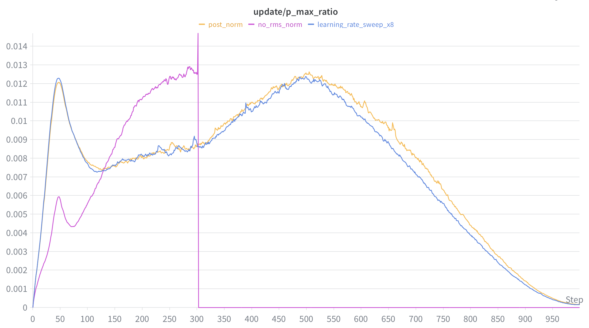
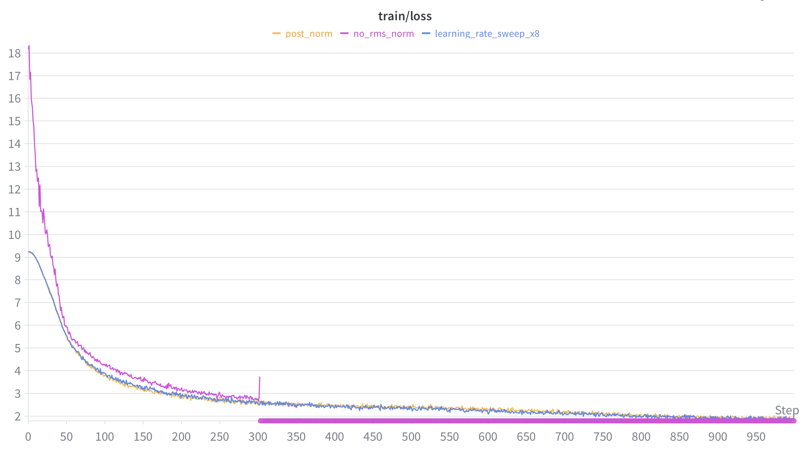

### Position Embedding - Remove RoPE
If we remove the position embeddings, the model does not learn as well as with them as expected. 
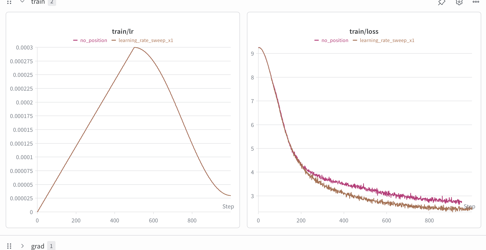


### After tuning 
Increased batch size to 256 and max learning rate to to 3e-4 * 8 * 2**0.5
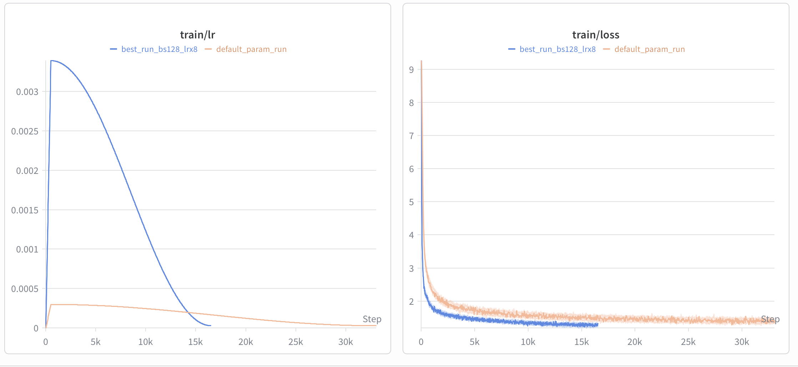
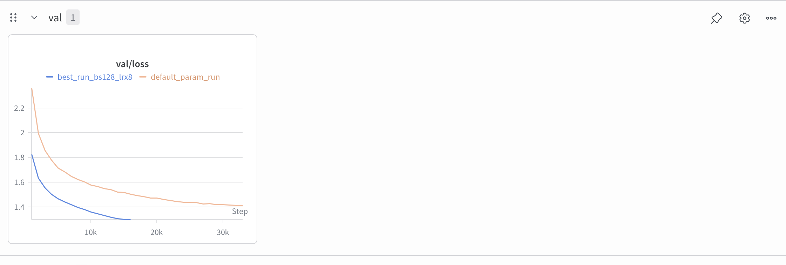

Sample Output of trained model
```
Once upon a time, there was a little girl named Lily. She had a big, red ball. She loved to play with her ball in the park. One day, she saw a small, helpless bird on the ground. The bird could not fly. Lily wanted to help the bird.
Lily said, "Don't worry, bird. I will help you." She picked up the bird and took it home. She gave the bird food and water. The bird started to feel better. Lily was happy that she could help the bird.
The next day, Lily went to the park again. She saw the bird again. This time, the bird was not helpless. It was a beautiful sight. The bird said, "Thank you, Lily, for helping me." Lily smiled and said, "You're welcome, bird. I'm glad I could help." They played together and became good friends.
<|endoftext|>
```


